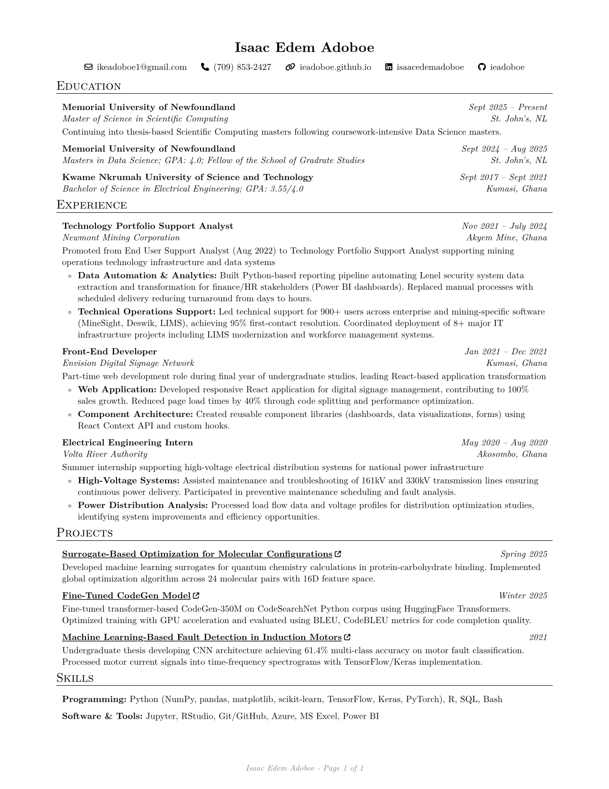

# Personal Resume

This is my resume template seen on Overleaf [renderCV's template](https://www.overleaf.com/latex/templates/rendercv-engineeringresumes-theme/shwqvsxdgkjy).

Render a resume from a YAML file.

## Preview

## Usage

### Installation

`pip install "rendercv[full]"`

## Getting started

To get started, navigate to the directory where you want to create your CV and run the command below to create the input files.

`rendercv new "Isaac Edem Adoboe" --theme "sb2nov"`

for the "sb2nov"-inspired resume.

RenderCV has more in depth guidelines at [https://docs.rendercv.com/user_guide/](https://docs.rendercv.com/user_guide/)

## Render Resume (or CV)

From the project root, run:

`rendercv render "Isaac_Edem_Adoboe_CV.yaml"`
